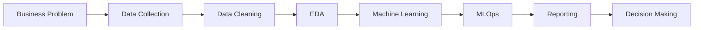
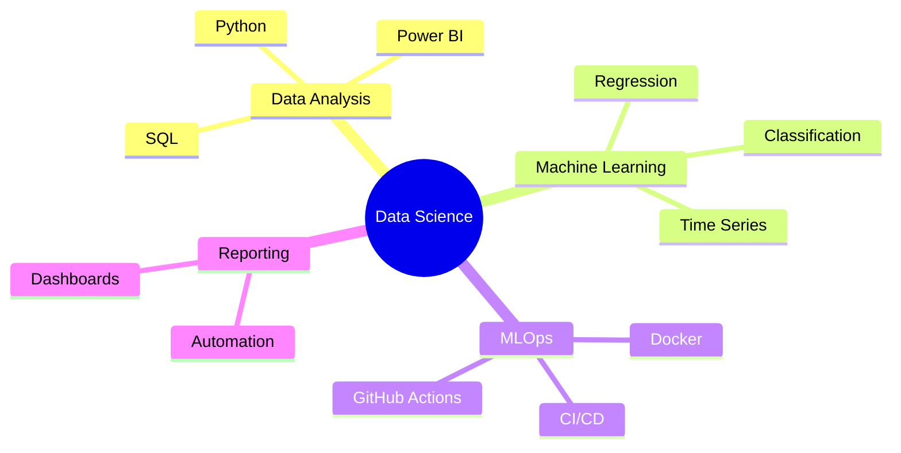

<h1 align="center">Bile Isaac</h1>

Data Scientist • Machine Learning • MLOps • Data Automation

Building reliable, scalable and actionable data solutions.

---

# Professional Workflow

---

# Technical Stack

---

# Core Skills

| Domain | Level |
|---------|--------|
| Data Analysis | ██████████ |
| Machine Learning | █████████░ |
| Python | █████████░ |
| SQL | ██████████ |
| R | ████████░░ |
| Power BI | ██████████ |
| Data Automation | ████████░░ |
| MLOps | ██████░░░░ |

---

# GitHub Statistics

---

# Current Focus

---

# Featured Projects

| Project | Description | Status |
|----------|-------------|--------|
| Sales Analysis | Exploratory Data Analysis | 🔄 In Progress |
| Customer Churn | Classification | ⏳ Planned |
| Reporting Automation | Python + SQL | ⏳ Planned |
| MLOps Pipeline | Docker + GitHub Actions | ⏳ Planned |

---

# Contact

