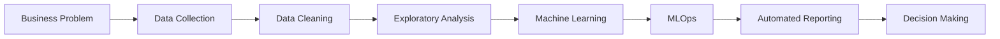
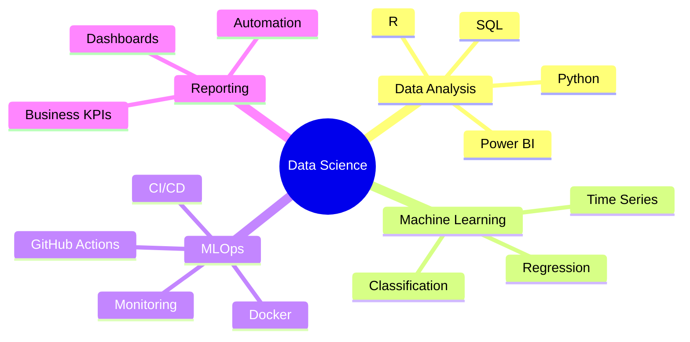

<h1 align="center">Bile Isaac</h1>

Data Scientist • Machine Learning • MLOps • Data Automation

Building reliable, scalable and actionable data solutions.

  
  
  

---

# Location

  

  <b>Based in France</b> • Open to Data Science, Reporting Automation and MLOps opportunities

---

# Professional Workflow

---

# Technical Stack

  

  
  
  
  

---

# Core Skills

| Domain | Level |
|---|---|
| Data Analysis | ██████████ |
| Machine Learning | █████████░ |
| Python | █████████░ |
| SQL | ██████████ |
| R | ████████░░ |
| Power BI | ██████████ |
| Data Automation | ████████░░ |
| MLOps | ██████░░░░ |

---

# GitHub Statistics

  
  

  

  

---

# Current Focus

---

# Featured Projects

| Project | Description | Stack | Status |
|---|---|---|---|
| Sales Analysis | Exploratory data analysis with professional visualizations | Python, SQL, Power BI | In Progress |
| Customer Churn | Classification model to predict customer churn | Python, Scikit-learn | Planned |
| Reporting Automation | Automated daily reporting pipeline | Python, SQL, GitHub Actions | Planned |
| MLOps Pipeline | End-to-end ML workflow with deployment and monitoring | Python, Docker, CI/CD | Planned |

---

# Portfolio Roadmap

---

# Contact

  

