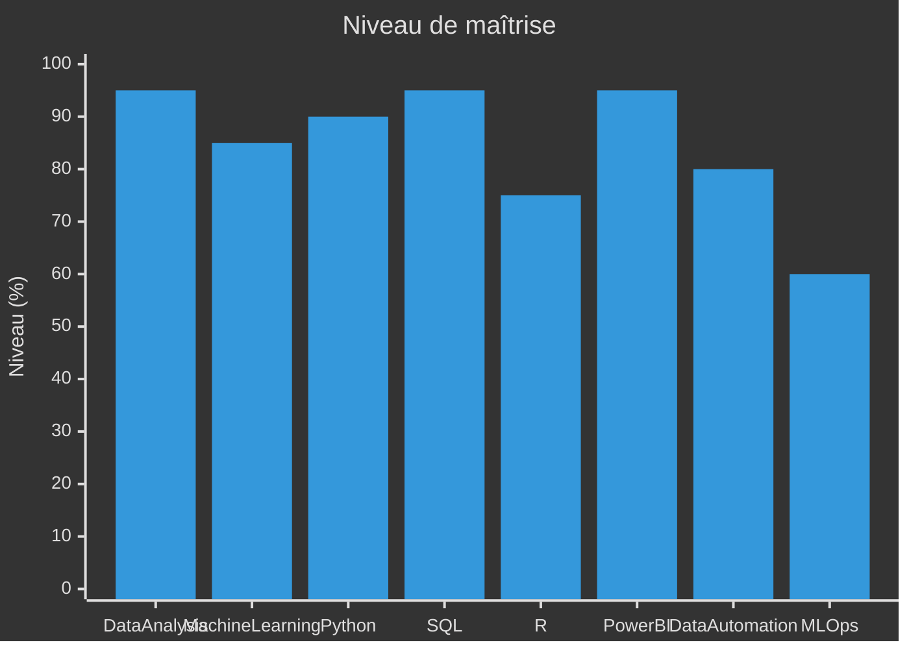
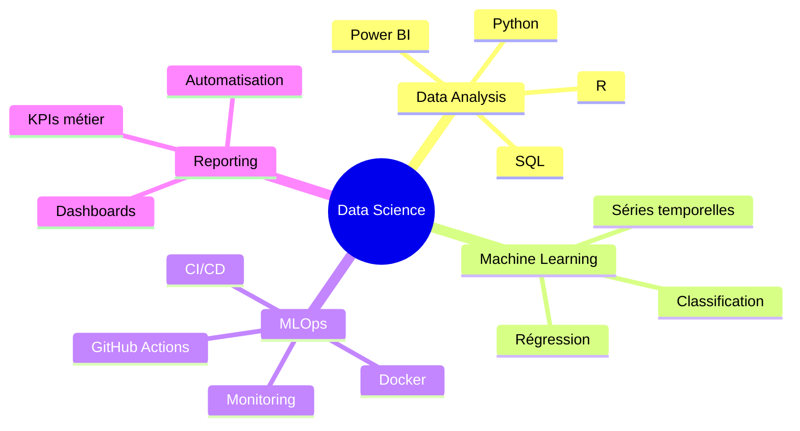
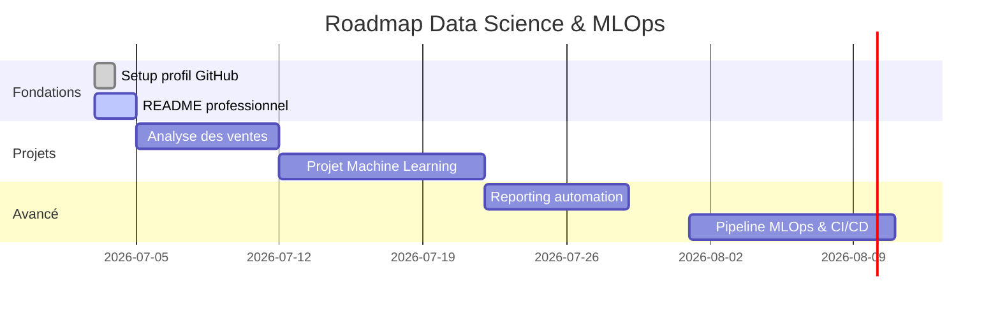

 

---

## 📍 Localisation — France

<!-- Carte animée centrée sur la France -->

  

**Basé en France 🇫🇷** • Ouvert aux opportunités Data Science, Reporting Automation & MLOps

---

## 🔁 Workflow Professionnel

```mermaid
flowchart LR
    A[🎯 Problème métier] --> B[📥 Collecte de données]
    B --> C[🧹 Nettoyage des données]
    C --> D[🔍 Analyse exploratoire]
    D --> E[🤖 Machine Learning]
    E --> F[⚙️ MLOps]
    F --> G[📊 Reporting automatisé]
    G --> H[✅ Aide à la décision]

    style A fill:#1f6feb,color:#fff
    style E fill:#2ea44f,color:#fff
    style F fill:#6f42c1,color:#fff
    style H fill:#f2c811,color:#000
```

---

## 🛠️ Stack Technique

  

---

## 📊 Compétences Clés

---

## 📈 Statistiques GitHub

<!-- Snake animation : nécessite un GitHub Action dans le repo (voir note en bas) -->

  

---

## 🧠 Focus Actuel

---

## 🚀 Projets Phares

| Projet | Description | Stack | Statut |
|---|---|:---:|:---:|
| 📊 **Sales Analysis** | Analyse exploratoire avec visualisations professionnelles | `Python` `SQL` `Power BI` | 🟡 En cours |
| 🔄 **Customer Churn** | Modèle de classification pour prédire le churn client | `Python` `Scikit-learn` | ⚪ Planifié |
| ⚙️ **Reporting Automation** | Pipeline de reporting quotidien automatisé | `Python` `SQL` `GitHub Actions` | ⚪ Planifié |
| 🐳 **MLOps Pipeline** | Workflow ML de bout en bout avec déploiement et monitoring | `Python` `Docker` `CI/CD` | ⚪ Planifié |

---

## 🗺️ Feuille de Route

---

## 📬 Contact

  

