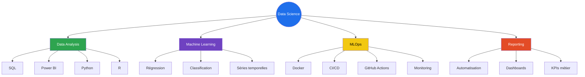

````md
<div align="center">


<a href="https://www.linkedin.com/in/bile-isaac-ama">
  
</a>

<br/>

<a href="https://www.linkedin.com/in/bile-isaac-ama">
  
</a>


</div>

---

## 👋 À propos de moi

Je suis **Bile Isaac**, passionné par la **Data Science**, le **Machine Learning**, le **Reporting automatisé** et les pratiques **MLOps**.

Mon objectif est de construire des solutions data fiables, utiles et compréhensibles, capables d’aider à la prise de décision métier.

---

## 📍 Localisation

<div align="center">


</div>

---

## 🔁 Workflow Professionnel

```mermaid
flowchart LR
    A[Problème métier] --> B[Collecte de données]
    B --> C[Nettoyage des données]
    C --> D[Analyse exploratoire]
    D --> E[Machine Learning]
    E --> F[MLOps]
    F --> G[Reporting automatisé]
    G --> H[Aide à la décision]

    style A fill:#1f6feb,color:#fff
    style E fill:#2ea44f,color:#fff
    style F fill:#6f42c1,color:#fff
    style H fill:#f2c811,color:#000
````

---

## 🛠️ Stack Technique

<div align="center">


<br/><br/>


</div>

---

## 📊 Compétences Clés

```mermaid
pie showData
    title Répartition des compétences
    "Data Analysis" : 95
    "SQL" : 95
    "Power BI" : 95
    "Python" : 90
    "Machine Learning" : 85
    "Data Automation" : 80
    "R" : 75
    "MLOps" : 60
```

---

## 📈 Statistiques GitHub

<div align="center">


<br/><br/>


<br/><br/>


<br/><br/>


</div>

---

## 🧠 Focus Actuel



---

## 🚀 Projets Phares

| Projet                      | Description                                                |              Stack              |    Statut   |
| --------------------------- | ---------------------------------------------------------- | :-----------------------------: | :---------: |
| 📊 **Sales Analysis**       | Analyse exploratoire avec visualisations professionnelles  |    `Python` `SQL` `Power BI`    | 🟡 En cours |
| 🔄 **Customer Churn**       | Modèle de classification pour prédire le churn client      |     `Python` `Scikit-learn`     |  ⚪ Planifié |
| ⚙️ **Reporting Automation** | Pipeline de reporting quotidien automatisé                 | `Python` `SQL` `GitHub Actions` |  ⚪ Planifié |
| 🐳 **MLOps Pipeline**       | Workflow ML de bout en bout avec déploiement et monitoring |    `Python` `Docker` `CI/CD`    |  ⚪ Planifié |

---

## 🗺️ Feuille de Route


---

## 📬 Contact

<div align="center">

<a href="https://www.linkedin.com/in/bile-isaac-ama">
  
</a>

<br/><br/>


</div>
```
